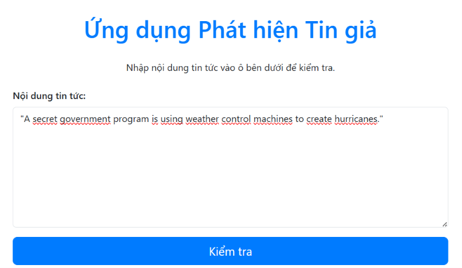
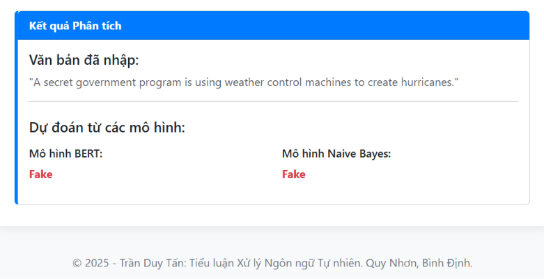

# Fake News Detection System

Dự án này là một hệ thống phân loại tin tức thành hai nhãn: **'Real'** (Tin thật) hoặc **'Fake'** (Tin giả). Hệ thống kết hợp cả phương pháp học sâu (Deep Learning) và học máy truyền thống (Machine Learning) để đưa ra dự đoán song song, đi kèm với một giao diện web trực quan.

## Tính năng nổi bật
* **Đa mô hình dự đoán:** Sử dụng đồng thời mô hình **BERT** (thông qua `transformers` và `PyTorch`) và **Multinomial Naive Bayes** (thông qua `scikit-learn` với TF-IDF) để đối chiếu kết quả.
* **Giao diện Web:** Tích hợp sẵn `Flask` để người dùng có thể nhập văn bản trực tiếp trên trình duyệt và xem ngay kết quả phân tích.
* **Xử lý ngôn ngữ tự nhiên (NLP):** Tự động làm sạch dữ liệu văn bản, loại bỏ các ký tự đặc biệt và stop-words tiếng Anh bằng thư viện `nltk` và biểu thức chính quy (`regex`).

## Cấu trúc dự án

* `app.py`: Chứa mã nguồn khởi chạy server web Flask và định tuyến (routing) đến giao diện hiển thị.
* `predict.py`: Hàm xử lý chính, chịu trách nhiệm tải các mô hình đã huấn luyện (`BERT_model` và `naive_bayes_model.pkl`) và đưa ra dự đoán cho cả hai mô hình.
* `train_BERT.py`: Mã nguồn huấn luyện mô hình BERT. Mã này hiện đang được thiết lập để đọc dữ liệu từ môi trường Kaggle (`/kaggle/input/fake-news-datasets/data/`).
* `train_naive_bayes.py`: Mã nguồn huấn luyện mô hình Naive Bayes, sử dụng `TfidfVectorizer` để trích xuất tối đa 5000 đặc trưng từ văn bản.
* `utils.py`: Chứa các hàm hỗ trợ như `clean_text()` để tiền xử lý văn bản và `load_dataset()` để gộp, gán nhãn dữ liệu từ các file CSV.

## Yêu cầu môi trường

Để chạy dự án, bạn cần cài đặt các thư viện sau:
pip install -r requirements.txt
Lưu ý: Huấn luyện BERT trên Kaggle

## Demo

### Home

### Kết quả
